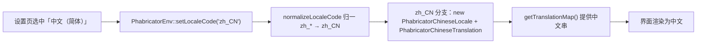

# 简体中文本地化（zh_CN）

本仓库在上游 Phorge 的基础上，内置了一套简体中文（`zh_CN`）界面本地化能力。中文是**可选**语言（默认语言仍为 `en_US`），用户可在个人设置中切换。

## 一、能力组成

中文本地化由以下几部分协同实现：

| 组成 | 路径 | 说明 |
|------|------|------|
| 翻译数据 | `src/infrastructure/internationalization/translation/PhabricatorChineseTranslation.php` | 约 2.7 万行的 `msgid → 中文` 映射（含复数/性别分支） |
| Locale 类 | `src/infrastructure/internationalization/locale/PhabricatorChineseLocale.php` | 定义 `zh_CN`，显示名「中文（简体）」，回退 `en_US` |
| 类映射注册 | `src/__phutil_library_map__.php` | 注册上述两个类（class map + extends map） |
| 设置项适配 | `src/applications/settings/setting/PhabricatorTranslationSetting.php` | 让 `zh_CN` 出现在语言下拉、通过校验，并合并 `zh_*` 变体 |
| 运行时加载 | `src/infrastructure/env/PhabricatorEnv.php` | `setLocaleCode()` 的 `zh_CN` 分支 + `normalizeLocaleCode()` |
| 校验豁免 | `src/infrastructure/internationalization/management/PhorgeInternationalizationValidator.php` | 使 i18n 校验工具不对 `zh_CN` 误报 |
| 翻译工具链 | `scripts/i18n/`、`resources/i18n-zh-*` | 用于检测缺失、批量生成/补全翻译（见第四节） |

> 为什么需要自建 Locale 类和运行时分支：`zh_CN` 的 Locale/Translation 类由本仓库自行提供，`libphutil` 的 `loadAllLocales()` / `loadLocale()` **无法自动发现**它们。因此设置页需要手动注入 `zh_CN` 选项，`PhabricatorEnv::setLocaleCode()` 也需要一个专门分支直接实例化自带类，否则即便在设置里选了中文也不会真正生效。

## 二、启用方式

中文默认可选，无需额外配置即可在界面中切换：

1. 登录后进入 **Settings → Account → Translation / 翻译**。
2. 在语言下拉中选择 **中文（简体）**。
3. 保存后界面即渲染为中文。

如需将**整站默认语言**设为中文（可选，非默认行为）：

- 修改 `PhabricatorTranslationSetting::getSettingDefaultValue()` 返回 `'zh_CN'`；或
- 将配置项 `locale.command` 默认值改为 `zh_CN`（影响命令行/后台任务的语言）。

当前仓库有意保持这两处为 `en_US`（中文可选而非强制默认）。

## 三、运行时加载链路



`normalizeLocaleCode()` 会把 `zh-CN`、`zh_Hans`、`zh_Hant`、`zh_*` 等归一化为 `zh_CN`，因此这些变体都会命中中文。

## 四、维护翻译（工具链）

翻译工具位于 `scripts/i18n/`，配套词表在 `resources/i18n-zh-*`。所有脚本使用**仓库根相对路径**，请在仓库根目录执行。

常用命令：

```bash
# 1) 检测当前缺失/未翻译的字符串（生成 top-N 清单到 resources/）
python3 scripts/i18n/check_zh_missing.py --top 1000 --out resources/i18n-zh-missing-top1000.txt

# 2) 按批生成/补全翻译（建议先 --dry-run 预览）
python3 scripts/i18n/improve_zh_batch.py --start-line 22 --end-line 1021 --dry-run
python3 scripts/i18n/improve_zh_batch.py --start-line 22 --end-line 1021 --limit 500

# 3) 一键循环补全（检测 → 补全，直至无缺失或达到最大轮数）
bash scripts/i18n/run_zh_autofill.sh
```

- 分批规划见 [`scripts/i18n/BATCH_PLAN_1000.md`](scripts/i18n/BATCH_PLAN_1000.md)（翻译文件共约 28 批，每批 1000 行）。
- 术语表见 [`resources/i18n-zh-glossary.md`](resources/i18n-zh-glossary.md)，用于统一译法。
- `translate_zh_api_batch.py` 支持调用翻译 API 批量处理；使用前请自行配置密钥，切勿把密钥硬编码进仓库。

修改翻译文件后，务必做语法检查：

```bash
php -l src/infrastructure/internationalization/translation/PhabricatorChineseTranslation.php
```

## 五、部署注意事项（OPcache）

`PhabricatorChineseTranslation.php` 有约 2.7 万行。在启用了 OPcache 的生产环境中，超大 PHP 文件偶发会触发「Failed to load symbol」类告警。若真正启用 `zh_CN` 并观察到此类问题，建议将该翻译文件加入 OPcache 黑名单：

- 在 `docker/php/opcache.ini` 指定 `opcache.blacklist_filename`；
- 在对应的 `opcache-blacklist.txt` 中加入该翻译文件路径。

这是部署层配置，不影响代码逻辑；未启用中文时无需处理。

## 六、相关决策

- **中文可选，不强制默认**：`getSettingDefaultValue()` 与 `locale.command` 均保持 `en_US`。
- **不改动 `PhabricatorUSEnglishTranslation.php`**：其在定制版中的差异来自上游已移除的 `phortune`/`fund` 应用字符串，本仓库不含这些应用，故不迁移。
